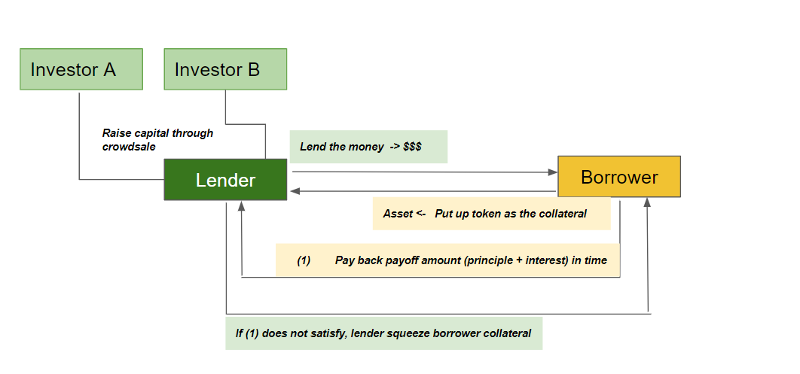

# Project 3: Application of Smart Contract in Lending Activity

## Context

Blockchain is transforming everything in financial transactions from raising money in capital markets, using it as an escrow to lending activities. Blockchain technology has the demonstrated potential to disrupt finance and banking services. This project aims to develop Decentralize Finance (Defi) via blockchain technology. 

## The Project

We deploy crowdsale method to raise funds for an ICO, used as the capital for lending. To make the lending activities less risky, a presequite of the lending is that the borrower put the collateral asset into a designated account at the same time we lend the money. The collateral amount only releases back to borrower when borrower pays off total loan amount fully and by the due date. If the borrower can not pay enough by the due date, the lender has the right to collect the collateral amount. 

## Flow of the transaction 

### Terms 
- Lender: A Lender/Bank/Financial Institutions have capital/money and want to lend out money to earn the interest. Raising capital via crowdsale
- Borrower: An individual has an asset and want to borrow money, willing to put asset as collateral

### Real application
- P2P lending with collateral: quick, easy and economically 

## Demo

### 1. ICO/Jupyter Notebook Demo

### 2. Loan Application/Processing Demo 

(video)

## Challenges

- Metamask and Remix errors 
- Langagues of different versions of Remix are different
- Overide the library/standard is hard
- Handling decimals in repayment calculation
- Streamlit

## Technology used in the project
- Jupyter Notebook
- Metamask
- Remix with mainly ERC20, Crowdsale, Mintable
- Deploying smart contract at the designated address (* new)