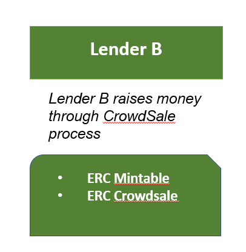

# Project 3: Application of Smart Contract in Lending Activity

## Context

Blockchain is transforming everything in financial transactions from raising money in capital markets, using it as an escrow, to lending activities. In other words, we strongly believe that blockchain technology is potential of disrupting finance and banking services. In this project, we aim to develop Decentralize Finance (Defi) via blockchain technology. 

## The Project

We are use crowdsale method considering it as raising funds/ ICO, then use the capital for lending. To make the lending activities less risky, presequite of the lending is that the borrower put the collateral asset into an designated account at the same time we lend the money. The collateral amount only releases back to borrower when borrower pays off total loan amount fully and by due date. If the borrower can not pay enough by due date, the lender has the right to collect the collateral amount. 

## Flow of the transaction 

### Terms 
- Lender: A Lender/ Bank / Financial Institutions have capital/money and want to lend out money to earn the interest. Raising capital via crowdsale
- Borrower: An individual has an asset and want to borrow money, willing to put asset as collateral

### Real application
- P2P lending with collateral: quick, easy and economically 

## Illustration

### ICO/Jupyter Notebook Illustration

### Lending with Smart Contracts 

