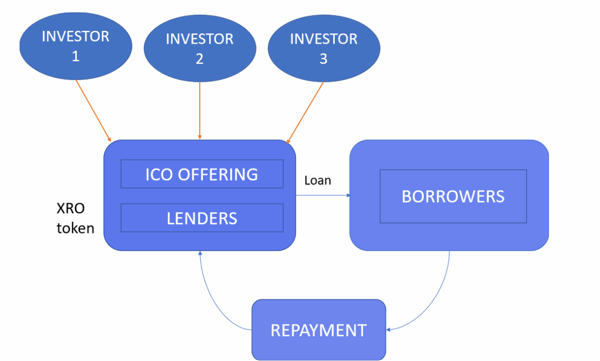

# Project 3: Application of Smart Contract in Lending Activity

## Context 

The goal of the project was to show the lending and repayment process using solidity. We used ICO as a method to start to raise capital for thier busines sor personal reasons. An established lender like a bank can finance companies for any business related situation. In these contracts we have shown how the loan contracts how a loan will be transacted using different solidity contracts.

Structure of transaction are as follows: 

## Simple Terms
- Borrower: Common people, or in this case the difference Ganache addres or account 9
- Lender: Banks or financial Institutions or account 10

## Smart Contracts Needed
- XRO Token Crowdsale and Mintable (Lender)
- Loan
- Loan Application
- Asset Token Mintable
- Loan Repayment
- App.py (streamlit)

### Key Assumptions:

- Currency: ETH 

## Proposed Timeline

| Write Smart Contract | Write Smart Contract | Write Smart Contract | Compile and test | Prepare Presentation | Final Curtain :) |
| ------------- | ------------- | ------------- |------------- | ------------- | ------------- |
|
|   |  |
| Date  |23/04     | 26/04    | 28/04   | 03/05   | 05/05   

## Resources 
* https://www.investopedia.com/terms/e/escrow.asp
* https://research.csiro.au/blockchainpatterns/general-patterns/blockchain-payment-patterns/escrow-2/ (for M&A mainly)
* https://academy.binance.com/en/articles/what-is-crypto-lending-and-how-does-it-work

